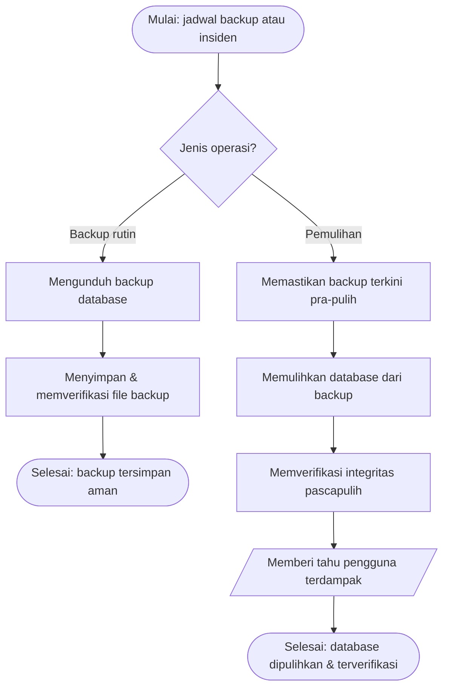

# SOP Pemeliharaan & Pemulihan Database

Prosedur Pemeliharaan & Pemulihan Database ini mengatur bagaimana Administrator Sistem menjaga
salinan data aplikasi Budget YPII tetap tersedia melalui backup berkala, dan memulihkan database dari
backup ketika terjadi insiden kehilangan atau kerusakan data. Prosedur menekankan verifikasi sebelum
dan sesudah pemulihan karena operasi restore menggantikan seluruh data aktif.

## Tujuan

Menjamin ketersediaan salinan data yang mutakhir dan memastikan database dapat dikembalikan ke
keadaan baik secara terkendali saat insiden, dengan risiko kehilangan data seminimal mungkin.

## Ruang Lingkup

Prosedur Pemeliharaan & Pemulihan Database berlaku untuk fitur Backup dan Restore di Panel Admin,
mencakup dua alur: backup rutin (terjadwal) dan pemulihan saat insiden. Prosedur dimulai dari pemicu
jadwal backup atau permintaan pemulihan, dan berakhir saat backup tersimpan aman atau database
berhasil dipulihkan dan diverifikasi.

## Definisi dan Singkatan

- **Backup** — file salinan database (`.db`) berisi seluruh data aplikasi.
- **Restore (pemulihan)** — mengganti database aktif dengan isi file backup; tidak dapat dibatalkan.
- **Insiden** — kejadian kehilangan/kerusakan data yang menjadi dasar pemulihan.

## Penanggung Jawab

Dalam prosedur Pemeliharaan & Pemulihan Database, peran yang terlibat adalah **Administrator Sistem**
(melakukan backup, restore, dan verifikasi) dan **Pengguna Terdampak** (menerima pemberitahuan hasil
pemulihan bila terjadi insiden).

## Dokumen/Alat yang Dibutuhkan

Prosedur Pemeliharaan & Pemulihan Database menggunakan halaman Database di Panel Admin aplikasi Budget
YPII (fitur Unduh Backup dan Restore Database) serta penyimpanan file backup yang aman.

## Prosedur

**Pemicu (Start Event)**: Proses dimulai oleh jadwal backup berkala (timer) atau oleh permintaan
pemulihan akibat insiden data (message).

**Pelaku (Lanes)**: Administrator Sistem dan Pengguna Terdampak.

### 1. [Keputusan: jenis operasi database]

**Pelaku (Lane)**: Administrator Sistem
**Tipe Gateway**: Exclusive (XOR)
**Aturan**: Jika pemicu adalah jadwal backup berkala → langkah 2 (alur backup); jika pemicu adalah
insiden yang membutuhkan pemulihan → langkah 4 (alur restore).
**Penggabungan (Merge)**: Kedua alur berakhir pada End Event masing-masing (backup tersimpan / database
dipulihkan).

### 2. Mengunduh backup database

**Tipe Task (BPMN)**: User Task
**Pelaku (Lane)**: Administrator Sistem
**Input (Data Object)**: Database aktif
**Aktivitas**: Mengunduh salinan database aktif sebagai file `.db` dari kartu Backup Database.
**Output (Data Object)**: File backup `.db`
**Rincian/turunan**: `IK-8beb6568`
**Alur berikutnya (Sequence Flow)**: → langkah 3

### 3. Menyimpan & memverifikasi file backup

**Tipe Task (BPMN)**: User Task
**Pelaku (Lane)**: Administrator Sistem
**Input (Data Object)**: File backup `.db`
**Aktivitas**: Menyimpan file backup di lokasi aman dan memastikan file terunduh utuh serta
dirahasiakan dari pihak tak berwenang.
**Output (Data Object)**: Backup tersimpan aman
**Alur berikutnya (Sequence Flow)**: → Akhir Proses (backup)

### 4. Memastikan backup terkini tersedia (pra-pulih)

**Tipe Task (BPMN)**: User Task
**Pelaku (Lane)**: Administrator Sistem
**Input (Data Object)**: Daftar file backup
**Aktivitas**: Mengunduh backup data terkini lebih dulu sebagai pengaman sebelum pemulihan, dan
memilih file backup sumber yang benar.
**Output (Data Object)**: Backup pengaman + file backup sumber terpilih
**Rincian/turunan**: `IK-8beb6568`
**Alur berikutnya (Sequence Flow)**: → langkah 5

### 5. Memulihkan database dari backup

**Tipe Task (BPMN)**: User Task
**Pelaku (Lane)**: Administrator Sistem
**Input (Data Object)**: File backup sumber terpilih
**Aktivitas**: Mengunggah file backup dan menjalankan Restore Database, mengganti seluruh data aktif
dengan isi file backup.
**Output (Data Object)**: Database hasil pemulihan
**Rincian/turunan**: `IK-c851c176`
**Alur berikutnya (Sequence Flow)**: → langkah 6

### 6. Memverifikasi integritas pascapulih

**Tipe Task (BPMN)**: User Task
**Pelaku (Lane)**: Administrator Sistem
**Input (Data Object)**: Database hasil pemulihan
**Aktivitas**: Memeriksa bahwa data kunci (organisasi, anggaran, akun) tampil benar setelah
pemulihan.
**Output (Data Object)**: Database terverifikasi
**Alur berikutnya (Sequence Flow)**: → langkah 7

### 7. Memberi tahu pengguna terdampak

**Tipe Task (BPMN)**: Send Task
**Pelaku (Lane)**: Administrator Sistem
**Input (Data Object)**: Status pemulihan
**Aktivitas**: Memberi tahu pengguna terdampak bahwa database telah dipulihkan dan keadaan data
terkini.
**Output (Data Object)**: Pemberitahuan terkirim
**Serah-terima (Message Flow)**: Administrator Sistem mengirimkan pemberitahuan ke lane Pengguna
Terdampak
**Alur berikutnya (Sequence Flow)**: → Akhir Proses (restore)

**Akhir Proses (End Event)**: "Backup tersimpan aman" (alur backup) atau "Database dipulihkan &
terverifikasi" (alur restore).

> Operasi restore (langkah 5) tidak dapat dibatalkan dan menggantikan seluruh data aktif; langkah 4
> (mengunduh backup pengaman) wajib dilakukan lebih dulu. Rincian teknis backup/restore ada pada
> Instruksi Kerja terkait.
{.is-danger}

## Titik Kontrol dan Verifikasi

Pada prosedur Pemeliharaan & Pemulihan Database, titik kontrol utama adalah langkah 4 (backup
pengaman wajib ada sebelum restore) dan langkah 6 (verifikasi data kunci setelah pemulihan). Pada
alur backup, langkah 3 memverifikasi file backup terunduh utuh.

## Pengecualian dan Eskalasi

Bila verifikasi pascapulih (langkah 6) menemukan data tidak konsisten, Administrator Sistem
memulihkan kembali dari backup pengaman (keluaran langkah 4) dan mengulang pemulihan; bila kegagalan
berulang, insiden dieskalasi ke penanggung jawab infrastruktur/pengembang aplikasi. File backup yang
korup atau berasal dari aplikasi lain tidak boleh digunakan untuk restore.

## Dokumen Terkait

- [IK Mengunduh Backup Database](../ik/ik-8beb6568-backup-database.md) — `IK-8beb6568`
- [IK Memulihkan (Restore) Database](../ik/ik-c851c176-restore-database.md) — `IK-c851c176`
