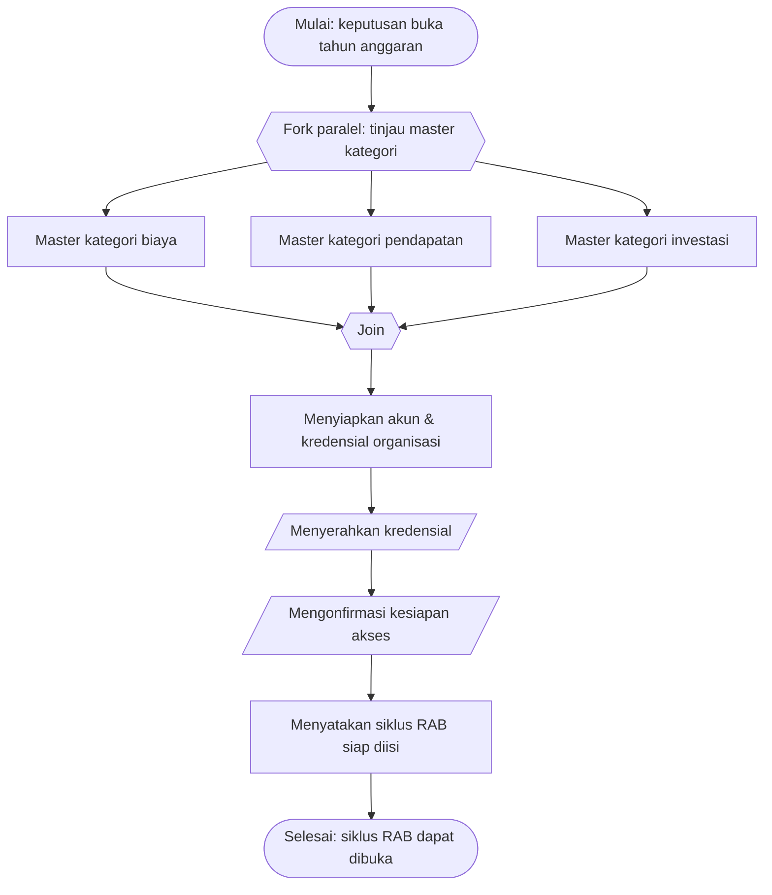

# SOP Persiapan Tahun Anggaran Baru

Prosedur Persiapan Tahun Anggaran Baru ini menyiapkan fondasi sistem sebelum siklus penyusunan RAB
dijalankan: memastikan master data kategori mutakhir dan setiap organisasi memiliki akun untuk
mengisi anggarannya. Prosedur dijalankan oleh Administrator Sistem dan menjadi prasyarat SOP Siklus
Konsolidasi RAB Berjenjang (`SOP-f68b0b7a`).

## Tujuan

Memastikan siklus RAB tahun anggaran baru dapat dibuka dengan master kategori (biaya, pendapatan,
investasi) yang benar dan lengkap, serta seluruh organisasi (Unit, Cabang, Pusat) memiliki akun aktif
dan kredensial yang telah diterima penanggung jawabnya.

## Ruang Lingkup

Prosedur Persiapan Tahun Anggaran Baru berlaku untuk kegiatan administrasi di Panel Admin, dimulai
saat keputusan membuka tahun anggaran baru diambil dan berakhir saat Administrator Sistem menyatakan
siklus RAB siap diisi. Penyusunan anggaran per organisasi berada di luar lingkup ini dan ditangani
oleh `SOP-f68b0b7a` beserta sub-SOP tingkatnya.

## Definisi dan Singkatan

- **Master kategori** — daftar kategori biaya, pendapatan, dan investasi yang dipakai seluruh
  organisasi saat input anggaran.
- **Akun organisasi** — kredensial login milik tiap Unit/Cabang/Pusat untuk mengisi RAB-nya.
- **Penanggung Jawab Organisasi** — orang yang menerima dan memakai kredensial organisasi.

## Penanggung Jawab

Dalam prosedur Persiapan Tahun Anggaran Baru, peran yang terlibat adalah **Administrator Sistem**
(menyiapkan master data & akun) dan **Penanggung Jawab Organisasi** (menerima kredensial dan
mengonfirmasi akses).

## Dokumen/Alat yang Dibutuhkan

Prosedur Persiapan Tahun Anggaran Baru menggunakan Panel Admin aplikasi Budget YPII (halaman Kategori
Biaya, Kategori Pendapatan, Kategori Investasi, dan Pengguna) serta saluran komunikasi aman untuk
menyerahkan kredensial kepada penanggung jawab organisasi.

## Prosedur

**Pemicu (Start Event)**: Proses dimulai ketika keputusan membuka tahun anggaran baru diambil (timer:
menjelang periode anggaran, atau message: instruksi memulai siklus).

**Pelaku (Lanes)**: Administrator Sistem dan Penanggung Jawab Organisasi.

### 1. [Keputusan: peninjauan master kategori secara paralel]

**Pelaku (Lane)**: Administrator Sistem
**Tipe Gateway**: Parallel (AND) — fork
**Aturan**: Peninjauan tiga master kategori (langkah 2, 3, dan 4) dikerjakan bersamaan karena saling
independen.
**Penggabungan (Merge)**: Ketiga jalur bertemu kembali di langkah 5 (join).

### 2. Meninjau & memperbarui master kategori biaya

**Tipe Task (BPMN)**: User Task
**Pelaku (Lane)**: Administrator Sistem
**Input (Data Object)**: Master kategori biaya tahun sebelumnya
**Aktivitas**: Menambah, mengubah, atau menonaktifkan kategori biaya beserta flag klasifikasinya
agar sesuai kebutuhan tahun anggaran baru.
**Output (Data Object)**: Master kategori biaya mutakhir
**Rincian/turunan**: `IK-5a258878`
**Alur berikutnya (Sequence Flow)**: → langkah 5

### 3. Meninjau & memperbarui master kategori pendapatan

**Tipe Task (BPMN)**: User Task
**Pelaku (Lane)**: Administrator Sistem
**Input (Data Object)**: Master kategori pendapatan tahun sebelumnya
**Aktivitas**: Menambah, mengubah, atau menonaktifkan kategori pendapatan beserta metode
kalkulasinya.
**Output (Data Object)**: Master kategori pendapatan mutakhir
**Rincian/turunan**: `IK-875b31a7`
**Alur berikutnya (Sequence Flow)**: → langkah 5

### 4. Meninjau & memperbarui master kategori investasi

**Tipe Task (BPMN)**: User Task
**Pelaku (Lane)**: Administrator Sistem
**Input (Data Object)**: Master kategori investasi tahun sebelumnya
**Aktivitas**: Menambah atau mengubah kategori investasi beserta umur ekonomis default per kategori.
**Output (Data Object)**: Master kategori investasi mutakhir
**Rincian/turunan**: `IK-2e8bacad`
**Alur berikutnya (Sequence Flow)**: → langkah 5

### 5. Menyiapkan akun & kredensial organisasi

**Tipe Task (BPMN)**: User Task
**Pelaku (Lane)**: Administrator Sistem
**Input (Data Object)**: Daftar organisasi (Unit/Cabang/Pusat) yang akan menyusun RAB
**Aktivitas**: Memastikan setiap organisasi memiliki akun; membuat akun baru atau mereset password
bagi organisasi yang membutuhkan.
**Output (Data Object)**: Akun organisasi aktif + kredensial
**Rincian/turunan**: `IK-eb6ca4bb`
**Alur berikutnya (Sequence Flow)**: → langkah 6

### 6. Menyerahkan kredensial ke penanggung jawab organisasi

**Tipe Task (BPMN)**: Send Task
**Pelaku (Lane)**: Administrator Sistem
**Input (Data Object)**: Kredensial organisasi
**Aktivitas**: Menyerahkan kredensial masing-masing organisasi kepada penanggung jawabnya melalui
saluran aman.
**Output (Data Object)**: Kredensial diterima organisasi
**Serah-terima (Message Flow)**: Administrator Sistem mengirimkan kredensial ke lane Penanggung Jawab
Organisasi
**Alur berikutnya (Sequence Flow)**: → langkah 7

### 7. Mengonfirmasi kesiapan akses

**Tipe Task (BPMN)**: Receive Task
**Pelaku (Lane)**: Administrator Sistem (menerima dari Penanggung Jawab Organisasi)
**Input (Data Object)**: Konfirmasi login berhasil dari organisasi
**Aktivitas**: Menerima konfirmasi bahwa penanggung jawab organisasi dapat login dan mengakses
organisasinya.
**Output (Data Object)**: Seluruh organisasi terkonfirmasi dapat mengakses
**Serah-terima (Message Flow)**: Penanggung Jawab Organisasi mengirimkan konfirmasi ke Administrator
Sistem
**Alur berikutnya (Sequence Flow)**: → langkah 8

### 8. Menyatakan siklus RAB siap diisi

**Tipe Task (BPMN)**: User Task
**Pelaku (Lane)**: Administrator Sistem
**Input (Data Object)**: Master data mutakhir + akun terkonfirmasi
**Aktivitas**: Menyatakan bahwa fondasi siap dan siklus RAB dapat dibuka.
**Output (Data Object)**: Siklus RAB siap diisi (masukan bagi `SOP-f68b0b7a` langkah 1)
**Serah-terima (Message Flow)**: Menyerahkan status kesiapan ke SOP induk `SOP-f68b0b7a`
**Alur berikutnya (Sequence Flow)**: → Akhir Proses

**Akhir Proses (End Event)**: "Fondasi tahun anggaran siap, siklus RAB dapat dibuka".

> Langkah peninjauan master kategori dan penyiapan akun dirinci pada Instruksi Kerja terkait di
> bagian Dokumen Terkait. Prosedur ini mendahului dan menjadi prasyarat SOP Siklus Konsolidasi RAB
> Berjenjang (`SOP-f68b0b7a`).
{.is-info}

## Titik Kontrol dan Verifikasi

Pada prosedur Persiapan Tahun Anggaran Baru, titik kontrol adalah langkah 7: siklus tidak dinyatakan
siap sebelum seluruh penanggung jawab organisasi mengonfirmasi dapat login. Verifikasi master data
dilakukan pada langkah 2–4 dengan memastikan flag kategori dan metode kalkulasi sesuai kebijakan
tahun berjalan.

## Pengecualian dan Eskalasi

Bila sebuah organisasi belum memiliki penanggung jawab atau kredensial tidak dapat diserahkan dengan
aman, Administrator Sistem menunda penyerahan untuk organisasi tersebut dan tetap melanjutkan
organisasi lain; siklus baru dinyatakan siap setelah seluruh organisasi terkonfirmasi. Masalah master
data yang memerlukan keputusan kebijakan dieskalasi ke Bidang Keuangan Pusat.

## Dokumen Terkait

- [SOP Siklus Konsolidasi RAB Berjenjang](sop-f68b0b7a-siklus-konsolidasi-rab-berjenjang.md) — `SOP-f68b0b7a` (proses yang diprasyarati prosedur ini)
- [IK Mengelola Kategori Biaya](../ik/ik-5a258878-mengelola-kategori-biaya.md) — `IK-5a258878`
- [IK Mengelola Kategori Pendapatan](../ik/ik-875b31a7-mengelola-kategori-pendapatan.md) — `IK-875b31a7`
- [IK Mengelola Kategori Investasi](../ik/ik-2e8bacad-mengelola-kategori-investasi.md) — `IK-2e8bacad`
- [IK Mengelola Akun & Reset Password](../ik/ik-eb6ca4bb-mengelola-akun-reset-password.md) — `IK-eb6ca4bb`
