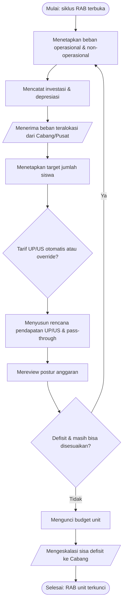

# SOP Penyusunan RAB Tingkat Unit

Prosedur Penyusunan RAB Tingkat Unit ini merinci bagaimana satu unit sekolah menyusun Rencana
Anggaran Belanja-nya. Prosedur ini merupakan sub-proses dari SOP Siklus Konsolidasi RAB Berjenjang
(`SOP-f68b0b7a`) dan dijalankan oleh Pengelola Anggaran Unit bersama Penanggung Jawab Unit. Prosedur
berjalan dalam tiga fase: penetapan beban (paralel dengan
tingkat lain), penyusunan rencana pendapatan setelah menerima beban teralokasi, serta review dan
penyesuaian postur hingga budget dikunci.

## Tujuan

Menghasilkan RAB unit yang telah diupayakan seimbang — pendapatan menutup seluruh beban, termasuk
beban kontribusi yang dialokasikan dari Cabang/Pusat — atau, bila defisit tak terhindarkan, RAB unit
yang terkunci dengan sisa defisit yang tercatat untuk dieskalasi ke Cabang.

## Ruang Lingkup

Prosedur Penyusunan RAB Tingkat Unit berlaku bagi organisasi bertipe UNIT. Prosedur dimulai saat unit
menetapkan bebannya (dalam fork paralel SOP induk) dan berakhir saat unit mengunci budget serta
mengeskalasi sisa defisit ke Cabang. Penetapan tarif kontribusi dan alokasi lintas-organisasi berada
di sub-SOP Cabang/Pusat, bukan di sini.

## Definisi dan Singkatan

- **UP / US** — Uang Pangkal / Uang Sekolah.
- **Beban teralokasi** — komponen beban UP yang diterima unit dari alokasi kontribusi & investasi
  keuangan Cabang/Pusat.
- **Pendapatan pass-through (direct income)** — pendapatan yang diteruskan langsung dan dapat
  dihitung otomatis atau di-override.
- **Override** — penggantian tarif/nilai otomatis dengan nilai yang ditetapkan manual oleh unit.

## Penanggung Jawab

Dalam prosedur Penyusunan RAB Tingkat Unit, peran yang terlibat adalah **Pengelola Anggaran Unit**
(menyusun & menginput), **Penanggung Jawab Unit** (memverifikasi & memutuskan penguncian), dan
**Sistem** (menghitung tarif dan depresiasi otomatis).

## Dokumen/Alat yang Dibutuhkan

Prosedur Penyusunan RAB Tingkat Unit menggunakan aplikasi Budget YPII pada modul organisasi unit:
label kelas, asumsi siswa, biaya operasional & non-operasional, investasi, depresiasi, entri
pendapatan, override direct income, simulasi, summary, dan penguncian budget. Data rincian biaya dan
daftar aset unit harus telah disiapkan.

## Prosedur

**Pemicu (Start Event)**: Proses dimulai ketika siklus RAB dibuka dan unit mulai menetapkan beban
(conditional: siklus RAB berstatus terbuka).

**Pelaku (Lanes)**: Pengelola Anggaran Unit, Penanggung Jawab Unit, dan Sistem.

### 1. Menetapkan beban operasional & non-operasional

**Tipe Task (BPMN)**: User Task
**Pelaku (Lane)**: Pengelola Anggaran Unit
**Input (Data Object)**: Rincian rencana biaya unit
**Aktivitas**: Menginput seluruh entri biaya operasional dan biaya non-operasional unit per kategori.
**Output (Data Object)**: Daftar beban operasional & non-operasional unit
**Rincian/turunan**: `IK-34237bc1` (biaya operasional), `IK-521ef63e` (biaya non-operasional)
**Alur berikutnya (Sequence Flow)**: → langkah 2

### 2. Mencatat investasi aset tetap & depresiasi aset lama

**Tipe Task (BPMN)**: User Task
**Pelaku (Lane)**: Pengelola Anggaran Unit
**Input (Data Object)**: Daftar rencana pembelian aset baru & daftar aset lama
**Aktivitas**: Mencatat investasi aset tetap baru dan beban depresiasi aset lama; sistem menghitung
depresiasi proporsional secara otomatis.
**Output (Data Object)**: Beban investasi & depresiasi unit
**Rincian/turunan**: `IK-86ddab34`, `IK-67c5682a`; kalkulasi depresiasi → `OTS-9c82d229`
**Alur berikutnya (Sequence Flow)**: → langkah 3

### 3. Menerima beban teralokasi dari Cabang/Pusat

**Tipe Task (BPMN)**: Receive Task
**Pelaku (Lane)**: Pengelola Anggaran Unit (menerima dari Sistem)
**Input (Data Object)**: Beban teralokasi (alokasi kontribusi & investasi keuangan Cabang/Pusat)
**Aktivitas**: Menerima dan meninjau total beban UP yang dialokasikan dari Cabang/Pusat sebagai
dasar penyusunan rencana pendapatan.
**Output (Data Object)**: Total beban unit (beban sendiri + beban teralokasi)
**Serah-terima (Message Flow)**: Sistem mengirimkan beban teralokasi ke unit (keluaran langkah 6 SOP
induk `SOP-f68b0b7a`)
**Rincian/turunan**: sumber aliran → `OTS-6f1cf35a`
**Alur berikutnya (Sequence Flow)**: → langkah 4

### 4. Menetapkan target jumlah siswa

**Tipe Task (BPMN)**: User Task
**Pelaku (Lane)**: Pengelola Anggaran Unit
**Input (Data Object)**: Proyeksi penerimaan siswa
**Aktivitas**: Mengatur label kelas dan mengisi asumsi siswa (sebaran per kelas, jumlah siswa baru
dan lama, jumlah staf).
**Output (Data Object)**: Asumsi siswa unit
**Rincian/turunan**: `IK-92c82c50` (label kelas), `IK-79bc84c4` (asumsi siswa)
**Alur berikutnya (Sequence Flow)**: → langkah 5

### 5. [Keputusan: tarif UP/US otomatis atau override?]

**Pelaku (Lane)**: Penanggung Jawab Unit
**Tipe Gateway**: Exclusive (XOR)
**Aturan**: Jika unit menerima tarif hasil kalkulasi sistem → biarkan otomatis (lanjut langkah 6);
jika unit menetapkan tarif sendiri → lakukan override tarif UP/US (langkah 6 dengan nilai manual).
Klasifikasi komponen biaya yang membentuk tarif mengikuti Decision Table `DT-b7d9cedd`.
**Penggabungan (Merge)**: Kedua jalur bertemu di langkah 6.

### 6. Menyusun rencana pendapatan UP/US & pass-through

**Tipe Task (BPMN)**: User Task
**Pelaku (Lane)**: Pengelola Anggaran Unit
**Input (Data Object)**: Asumsi siswa, total beban unit, keputusan otomatis/override (langkah 5)
**Aktivitas**: Menetapkan tarif UP/US (otomatis dari sistem atau override), lalu memutuskan
pendapatan pass-through (direct income) secara otomatis atau di-override, dan mencatat pendapatan
lain-lain.
**Output (Data Object)**: Rencana pendapatan unit
**Rincian/turunan**: `IK-5f6198f9` (override UP/US & direct income), `IK-c67d79bf` (pendapatan
lain-lain); kalkulasi tarif otomatis → `OTS-6f1cf35a`
**Alur berikutnya (Sequence Flow)**: → langkah 7

### 7. Mereview postur anggaran unit

**Tipe Task (BPMN)**: User Task
**Pelaku (Lane)**: Penanggung Jawab Unit
**Input (Data Object)**: Total beban unit + rencana pendapatan unit
**Aktivitas**: Menjalankan simulasi dan meninjau summary untuk menilai apakah unit surplus,
seimbang, atau defisit.
**Output (Data Object)**: Postur anggaran unit (surplus/seimbang/defisit)
**Rincian/turunan**: `IK-e54fa33c` (simulasi), `IK-71a239ba` (summary)
**Alur berikutnya (Sequence Flow)**: → langkah 8

### 8. [Keputusan: unit defisit dan masih dapat disesuaikan?]

**Pelaku (Lane)**: Penanggung Jawab Unit
**Tipe Gateway**: Exclusive (XOR)
**Aturan**: Jika defisit **dan** masih ada pendapatan yang dapat ditambah atau beban yang dapat
dikurangi → kembali ke langkah 1/6 untuk menyesuaikan (loop). Jika seimbang/surplus, **atau** defisit
namun sudah tidak ada yang dapat disesuaikan → lanjut langkah 9. Tuas dan urutan penyesuaian yang
tersedia di tingkat Unit ditentukan oleh Decision Table `DT-e348eca6`.
**Penggabungan (Merge)**: Jalur penyesuaian kembali bertemu alur utama di langkah 7 (review ulang);
jalur "lanjut" menuju langkah 9.

### 9. Mengunci budget unit

**Tipe Task (BPMN)**: User Task
**Pelaku (Lane)**: Penanggung Jawab Unit
**Input (Data Object)**: RAB unit final versi unit
**Aktivitas**: Mengunci budget unit agar tidak dapat diubah, menandai kesiapan untuk konsolidasi
Cabang.
**Output (Data Object)**: RAB unit terkunci (+ status defisit bila ada)
**Rincian/turunan**: `IK-acb4298f`
**Alur berikutnya (Sequence Flow)**: → langkah 10

### 10. Mengeskalasi sisa defisit ke Cabang

**Tipe Task (BPMN)**: Send Task
**Pelaku (Lane)**: Penanggung Jawab Unit
**Input (Data Object)**: RAB unit terkunci + status defisit
**Aktivitas**: Menyerahkan RAB unit yang terkunci beserta sisa defisitnya kepada Cabang untuk
dievaluasi.
**Output (Data Object)**: Notifikasi eskalasi ke Cabang
**Serah-terima (Message Flow)**: Unit mengirimkan RAB terkunci & status defisit ke lane Cabang
(masuk ke `SOP-a8608e7a`)
**Alur berikutnya (Sequence Flow)**: → Akhir Proses

**Akhir Proses (End Event)**: "RAB unit terkunci & seimbang" (tanpa defisit) atau "RAB unit terkunci
& dieskalasi ke Cabang" (dengan sisa defisit).

> Keputusan penyesuaian defisit di langkah 8 mengikuti Decision Table `DT-e348eca6`. Klasifikasi
> komponen biaya pembentuk tarif (langkah 5) mengikuti `DT-b7d9cedd`. Kalkulasi tarif dan depresiasi
> dijalankan sistem — lihat `OTS-6f1cf35a` dan `OTS-9c82d229`.
{.is-info}

## Titik Kontrol dan Verifikasi

Pada prosedur Penyusunan RAB Tingkat Unit, titik kontrol utama adalah langkah 3 (unit wajib
menerima beban teralokasi sebelum menyusun pendapatan) dan langkah 8 (Penanggung Jawab Unit memverifikasi
postur anggaran sebelum penguncian). Penguncian pada langkah 9 hanya dilakukan setelah Penanggung Jawab Unit
memastikan tidak ada lagi penyesuaian yang layak dilakukan.

## Pengecualian dan Eskalasi

Bila unit tetap defisit setelah seluruh tuas penyesuaian di tingkatnya habis (sesuai
`DT-e348eca6`), unit **tidak** menahan proses: unit tetap mengunci budget (langkah 9) dan
mengeskalasi sisa defisit ke Cabang (langkah 10). Pembukaan kembali budget yang telah dikunci hanya
atas persetujuan Cabang/Pusat dan dilakukan melalui `IK-acb4298f`.

## Dokumen Terkait

- [SOP Siklus Konsolidasi RAB Berjenjang](sop-f68b0b7a-siklus-konsolidasi-rab-berjenjang.md) — `SOP-f68b0b7a` (induk)
- [SOP Evaluasi & Konsolidasi RAB Tingkat Cabang](sop-a8608e7a-evaluasi-konsolidasi-rab-tingkat-cabang.md) — `SOP-a8608e7a` (tingkat eskalasi berikutnya)
- [DT Opsi Penanganan Defisit per Tingkat](../dt/dt-e348eca6-opsi-penanganan-defisit.md) — `DT-e348eca6`
- [DT Klasifikasi Komponen Biaya](../dt/dt-b7d9cedd-klasifikasi-komponen-biaya.md) — `DT-b7d9cedd`
- [OTS Kalkulasi Otomatis Tarif UP & US](../ots/ots-6f1cf35a-kalkulasi-tarif-up-us.md) — `OTS-6f1cf35a`
- [OTS Kalkulasi Depresiasi Proporsional](../ots/ots-9c82d229-kalkulasi-depresiasi-proporsional.md) — `OTS-9c82d229`
- Instruksi Kerja terkait: `IK-92c82c50`, `IK-79bc84c4`, `IK-5f6198f9`, `IK-34237bc1`,
  `IK-521ef63e`, `IK-86ddab34`, `IK-67c5682a`, `IK-c67d79bf`, `IK-e54fa33c`, `IK-71a239ba`,
  `IK-acb4298f`
