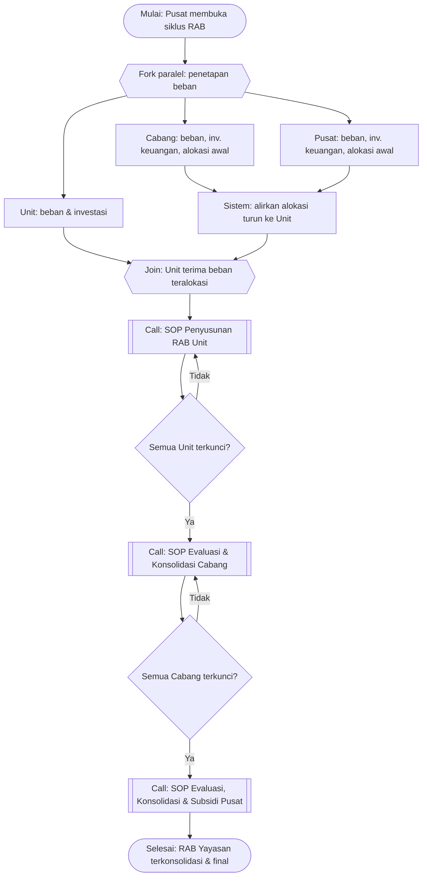

# SOP Siklus Konsolidasi RAB Berjenjang

Prosedur Siklus Konsolidasi RAB Berjenjang ini adalah proses induk penyusunan Rencana Anggaran
Belanja (RAB) tahunan seluruh organisasi di bawah suatu yayasan pendidikan. Prosedur ini
mengorkestrasi tiga tingkat pelaku — Unit, Cabang, dan Pusat — dalam dua arah aliran:
**arah turun** (penetapan beban dan alokasi kontribusi yang berjalan paralel dan mengalir dari
Pusat/Cabang ke Unit) dan **arah naik** (eskalasi penanganan defisit dari Unit ke Cabang ke Pusat).
Prosedur ini memanggil tiga sub-SOP tingkat sebagai Call Activity dan menetapkan gerbang sinkronisasi
di antaranya.

## Tujuan

Menghasilkan RAB tahunan yang **terkonsolidasi dan seimbang** untuk seluruh Yayasan: setiap Unit
memiliki postur anggaran yang telah diupayakan bebas defisit, sisa defisit yang tak terselesaikan
di satu tingkat dieskalasi ke tingkat di atasnya secara tertib, dan subsidi Pusat digunakan hanya
sebagai upaya terakhir.

## Ruang Lingkup

Prosedur Siklus Konsolidasi RAB Berjenjang berlaku untuk satu tahun anggaran penuh, dimulai saat
Pusat membuka siklus RAB dan berakhir saat Pusat mengunci siklus setelah seluruh Cabang dan Unit
terkunci. Prosedur ini mencakup orkestrasi lintas tingkat; rincian aktivitas di tiap tingkat berada
pada sub-SOP masing-masing (Unit, Cabang, Pusat) yang ditautkan pada bagian Prosedur dan Dokumen
Terkait.

## Definisi dan Singkatan

- **RAB** — Rencana Anggaran Belanja.
- **UP / US** — Uang Pangkal / Uang Sekolah.
- **Beban teralokasi** — komponen beban UP yang dialirkan Cabang/Pusat ke Unit melalui alokasi
  kontribusi dan investasi keuangan.
- **Eskalasi** — penyerahan sisa defisit yang tak dapat diselesaikan suatu tingkat ke tingkat di
  atasnya.
- **Kunci budget** — penguncian data anggaran organisasi agar tidak dapat diubah, menandai
  kesiapan untuk konsolidasi tingkat berikutnya.

## Penanggung Jawab

Dalam prosedur Siklus Konsolidasi RAB Berjenjang, peran yang terlibat sebagai swimlane adalah:

- **Pengelola Anggaran Pusat** — membuka & menutup siklus, menetapkan beban & alokasi tingkat
  Pusat, dan menjadi tingkat eskalasi terakhir.
- **Pengelola Anggaran Cabang** — menetapkan beban & alokasi tingkat Cabang, mengevaluasi
  unit-unit di bawahnya, dan mengeskalasi ke Pusat.
- **Pengelola Anggaran Unit** & **Penanggung Jawab Unit** — menyusun RAB unit dan mengeskalasi ke
  Cabang.
- **Sistem** — menghitung tarif dan mengalirkan beban teralokasi.

## Dokumen/Alat yang Dibutuhkan

Prosedur Siklus Konsolidasi RAB Berjenjang menggunakan aplikasi Budget YPII (modul organisasi,
simulasi, alokasi, subsidi, dan penguncian budget), master data yang telah disiapkan melalui SOP
Persiapan Tahun Anggaran Baru (`SOP-955c5e4b`), serta akun organisasi untuk tiap Unit, Cabang, dan
Pusat.

## Prosedur

**Pemicu (Start Event)**: Proses dimulai ketika Pusat membuka siklus RAB untuk tahun anggaran
berjalan (message: instruksi pembukaan siklus).

**Pelaku (Lanes)**: Pusat, Cabang, Unit, dan Sistem.

### 1. Membuka siklus RAB tahun anggaran

**Tipe Task (BPMN)**: User Task
**Pelaku (Lane)**: Pusat
**Input (Data Object)**: Master kategori & akun organisasi yang siap (keluaran `SOP-955c5e4b`)
**Aktivitas**: Menetapkan tahun anggaran aktif dan menyatakan siklus RAB terbuka untuk seluruh
tingkat.
**Output (Data Object)**: Siklus RAB berstatus terbuka
**Rincian/turunan**: Prasyarat pada `SOP-955c5e4b`
**Alur berikutnya (Sequence Flow)**: → langkah 2

### 2. [Keputusan: percabangan paralel penetapan beban]

**Pelaku (Lane)**: Pusat, Cabang, Unit
**Tipe Gateway**: Parallel (AND) — fork
**Aturan**: Ketiga cabang aktivitas (langkah 3, 4, dan 5) dijalankan **bersamaan**; masing-masing
tingkat menetapkan beban dan investasinya tanpa menunggu tingkat lain.
**Penggabungan (Merge)**: Ketiga jalur bertemu kembali pada langkah 7 (join), setelah alokasi
mengalir turun pada langkah 6.

### 3. Menetapkan beban & investasi tingkat Unit

**Tipe Task (BPMN)**: User Task
**Pelaku (Lane)**: Unit
**Input (Data Object)**: Rencana biaya & daftar aset unit
**Aktivitas**: Menetapkan biaya operasional, biaya non-operasional, investasi aset tetap, dan
depresiasi aset lama tingkat Unit (Fase 1 dari `SOP-d3d42a08`).
**Output (Data Object)**: Beban dasar Unit
**Rincian/turunan**: `SOP-d3d42a08` (Fase 1); IK: `IK-34237bc1`, `IK-521ef63e`, `IK-86ddab34`,
`IK-67c5682a`
**Alur berikutnya (Sequence Flow)**: → langkah 6

### 4. Menetapkan beban, investasi keuangan & alokasi kontribusi awal tingkat Cabang

**Tipe Task (BPMN)**: User Task
**Pelaku (Lane)**: Cabang
**Input (Data Object)**: Rencana biaya Cabang, daftar instrumen investasi keuangan, kebijakan
kontribusi
**Aktivitas**: Menetapkan beban Cabang, mencatat investasi keuangan, dan menyusun alokasi
kontribusi UP/US awal ke unit-unit di bawahnya.
**Output (Data Object)**: Beban Cabang + alokasi kontribusi awal
**Rincian/turunan**: IK: `IK-52fc9ca3`, `IK-7fb3eb50`, `IK-560c6a91`; tarif acuan → `DT-e80fe01d`
**Alur berikutnya (Sequence Flow)**: → langkah 6

### 5. Menetapkan beban, investasi keuangan & alokasi kontribusi awal tingkat Pusat

**Tipe Task (BPMN)**: User Task
**Pelaku (Lane)**: Pusat
**Input (Data Object)**: Rencana biaya Pusat, daftar instrumen investasi keuangan, kebijakan
kontribusi
**Aktivitas**: Menetapkan beban Pusat, mencatat investasi keuangan, dan menyusun alokasi
kontribusi UP/US awal ke tingkat di bawahnya.
**Output (Data Object)**: Beban Pusat + alokasi kontribusi awal
**Rincian/turunan**: IK: `IK-52fc9ca3`, `IK-7fb3eb50`, `IK-560c6a91`; tarif acuan → `DT-e80fe01d`
**Alur berikutnya (Sequence Flow)**: → langkah 6

### 6. Mengalirkan alokasi kontribusi & investasi keuangan ke tiap Unit

**Tipe Task (BPMN)**: Service Task
**Pelaku (Lane)**: Sistem
**Input (Data Object)**: Alokasi kontribusi awal & investasi keuangan Cabang/Pusat (keluaran
langkah 4 dan langkah 5)
**Aktivitas**: Sistem menghitung dan mengalirkan alokasi kontribusi serta beban investasi keuangan
dari Cabang/Pusat turun menjadi komponen beban UP pada tiap Unit.
**Output (Data Object)**: Beban teralokasi per Unit
**Serah-terima (Message Flow)**: Sistem mengirimkan beban teralokasi ke lane Unit
**Rincian/turunan**: → `OTS-6f1cf35a`; tarif kontribusi → `DT-e80fe01d`
**Alur berikutnya (Sequence Flow)**: → langkah 7

### 7. [Keputusan: sinkronisasi sebelum rencana pendapatan Unit]

**Pelaku (Lane)**: Unit, Sistem
**Tipe Gateway**: Parallel (AND) — join
**Aturan**: Proses berlanjut ke langkah 8 hanya setelah **beban dasar Unit (langkah 3) dan beban
teralokasi (langkah 6) tersedia**. Unit tidak boleh menyusun rencana pendapatan sebelum mengetahui
total beban teralokasi.
**Penggabungan (Merge)**: Titik gabung dari fork langkah 2.

### 8. Menyusun RAB Unit hingga terkunci

**Tipe Task (BPMN)**: Call Activity
**Pelaku (Lane)**: Unit
**Input (Data Object)**: Beban dasar Unit + beban teralokasi
**Aktivitas**: Menjalankan sub-proses penyusunan RAB Unit: rencana pendapatan (target siswa, tarif
UP/US otomatis/override, pendapatan pass-through), review postur, penyesuaian defisit, penguncian,
dan eskalasi sisa defisit ke Cabang.
**Output (Data Object)**: RAB Unit terkunci (+ status defisit bila ada)
**Serah-terima (Message Flow)**: Unit mengeskalasi sisa defisit ke Cabang
**Rincian/turunan**: → `SOP-d3d42a08` (Fase 2–3)
**Alur berikutnya (Sequence Flow)**: → langkah 9

### 9. [Keputusan: apakah seluruh Unit sudah terkunci?]

**Pelaku (Lane)**: Cabang
**Tipe Gateway**: Exclusive (XOR)
**Aturan**: Jika seluruh Unit di bawah Cabang telah mengunci RAB → langkah 10; selain itu →
menunggu Unit yang belum terkunci (kembali menanti langkah 8).
**Penggabungan (Merge)**: Kedua jalur bertemu di langkah 10.

### 10. Mengevaluasi & mengonsolidasi RAB tingkat Cabang hingga terkunci

**Tipe Task (BPMN)**: Call Activity
**Pelaku (Lane)**: Cabang
**Input (Data Object)**: RAB seluruh Unit yang terkunci + status defisit
**Aktivitas**: Menjalankan sub-proses evaluasi Cabang: menilai unit defisit, memilih tuas
penanganan (menurunkan beban/pendapatan Cabang atau meredistribusi alokasi kontribusi), mengunci
RAB Cabang, dan mengeskalasi sisa defisit ke Pusat.
**Output (Data Object)**: RAB Cabang terkunci (+ status defisit bila ada)
**Serah-terima (Message Flow)**: Cabang mengeskalasi sisa defisit ke Pusat
**Rincian/turunan**: → `SOP-a8608e7a`
**Alur berikutnya (Sequence Flow)**: → langkah 11

### 11. [Keputusan: apakah seluruh Cabang sudah terkunci?]

**Pelaku (Lane)**: Pusat
**Tipe Gateway**: Exclusive (XOR)
**Aturan**: Jika seluruh Cabang telah mengunci RAB → langkah 12; selain itu → menunggu Cabang yang
belum terkunci (kembali menanti langkah 10).
**Penggabungan (Merge)**: Kedua jalur bertemu di langkah 12.

### 12. Mengevaluasi, mengonsolidasi & mensubsidi RAB tingkat Pusat

**Tipe Task (BPMN)**: Call Activity
**Pelaku (Lane)**: Pusat
**Input (Data Object)**: RAB seluruh Cabang yang terkunci + status defisit
**Aktivitas**: Menjalankan sub-proses evaluasi Pusat: menilai unit yang masih defisit, mengurangi
kontribusi atau meminta pengurangan biaya unit, lalu memberikan subsidi sebagai upaya terakhir.
**Output (Data Object)**: RAB Pusat terkunci; unit defisit tertangani
**Rincian/turunan**: → `SOP-3ded94ef`
**Alur berikutnya (Sequence Flow)**: → langkah 13

### 13. Memfinalisasi & mengunci siklus RAB

**Tipe Task (BPMN)**: User Task
**Pelaku (Lane)**: Pusat
**Input (Data Object)**: Seluruh RAB tingkat terkunci
**Aktivitas**: Menyatakan siklus RAB tahun anggaran selesai dan mengunci konsolidasi akhir.
**Output (Data Object)**: RAB Yayasan terkonsolidasi & final
**Alur berikutnya (Sequence Flow)**: → Akhir Proses

**Akhir Proses (End Event)**: "RAB Yayasan terkonsolidasi & final" (seluruh tingkat seimbang atau
defisit tersisa telah disubsidi Pusat).

> Langkah keputusan penanganan defisit multi-kondisi di tiap tingkat dirujuk ke Decision Table
> `DT-e348eca6`. Langkah kalkulasi tarif & pengaliran alokasi dijalankan sistem — lihat
> `OTS-6f1cf35a`.
{.is-info}

## Titik Kontrol dan Verifikasi

Pada prosedur Siklus Konsolidasi RAB Berjenjang, titik kontrol berada di setiap gerbang
penguncian: siklus tidak berpindah ke tingkat berikutnya sebelum seluruh organisasi pada tingkat
sebelumnya terkunci (langkah 9 dan langkah 11). Verifikasi akhir dilakukan Pusat pada langkah 13,
memastikan tidak ada Unit yang masih defisit tanpa penanganan.

## Pengecualian dan Eskalasi

Eskalasi adalah mekanisme inti prosedur ini: sisa defisit yang tak dapat diselesaikan di Unit
diserahkan ke Cabang (langkah 8), dan yang tak dapat diselesaikan Cabang diserahkan ke Pusat
(langkah 10). Bila hingga langkah 12 masih terdapat unit defisit, Pusat wajib menutupnya dengan
subsidi. Penyimpangan dari urutan penguncian (mis. membuka kembali budget yang telah dikunci)
hanya boleh atas persetujuan tingkat di atasnya dan dicatat melalui `IK-acb4298f`.

## Dokumen Terkait

- [SOP Penyusunan RAB Tingkat Unit](sop-d3d42a08-penyusunan-rab-tingkat-unit.md) — `SOP-d3d42a08`
- [SOP Evaluasi & Konsolidasi RAB Tingkat Cabang](sop-a8608e7a-evaluasi-konsolidasi-rab-tingkat-cabang.md) — `SOP-a8608e7a`
- [SOP Evaluasi, Konsolidasi & Subsidi RAB Tingkat Pusat](sop-3ded94ef-evaluasi-konsolidasi-subsidi-rab-tingkat-pusat.md) — `SOP-3ded94ef`
- [SOP Persiapan Tahun Anggaran Baru](sop-955c5e4b-persiapan-tahun-anggaran-baru.md) — `SOP-955c5e4b` (prasyarat)
- [DT Opsi Penanganan Defisit per Tingkat](../dt/dt-e348eca6-opsi-penanganan-defisit.md) — `DT-e348eca6`
- [DT Tarif Kontribusi Default](../dt/dt-e80fe01d-tarif-kontribusi-default.md) — `DT-e80fe01d`
- [OTS Kalkulasi Otomatis Tarif UP & US](../ots/ots-6f1cf35a-kalkulasi-tarif-up-us.md) — `OTS-6f1cf35a`
