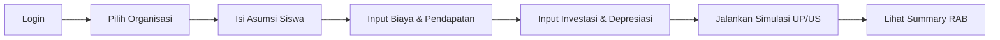

# Panduan Penggunaan Budget Sekolah

Selamat datang di dokumentasi **Budget Sekolah** — Sistem Simulasi Anggaran (RAB) untuk
satuan pendidikan.

Aplikasi ini membantu setiap satuan pendidikan, cabang, dan pusat pengelola menyusun
**Rencana Anggaran Biaya (RAB)** secara terstruktur: mulai dari asumsi jumlah siswa,
biaya operasional dan non-operasional, investasi, depresiasi, hingga simulasi tarif
**Uang Pangkal (UP)** dan **Uang Sekolah (US)** serta alokasi kontribusi antar
organisasi.

## Untuk siapa dokumentasi ini?

- **Pengguna Organisasi (ORG)** — staf unit/cabang yang menginput data anggaran dan
  menjalankan simulasi untuk organisasinya sendiri.
- **Administrator (ADMIN)** — pengelola lembaga yang mengatur struktur organisasi,
  pengguna, dan data master (kategori pendapatan, biaya, dan investasi).

## Mulai dari mana?

-   :material-rocket-launch: __Memulai__

    Login, mengenal antarmuka, dan navigasi dasar.

    [:octicons-arrow-right-24: Memulai](memulai.md)

-   :material-lightbulb-on: __Konsep Dasar__

    Pahami Organisasi, Role, UP/US, dan basis kas vs akrual.

    [:octicons-arrow-right-24: Konsep Dasar](konsep.md)

-   :material-database-edit: __Input Data Anggaran__

    Asumsi siswa, biaya, investasi, depresiasi, dan pendapatan.

    [:octicons-arrow-right-24: Data Anggaran](data-anggaran.md)

-   :material-chart-line: __Simulasi & Laporan__

    Jalankan simulasi RAB dan baca ringkasan anggaran.

    [:octicons-arrow-right-24: Simulasi](simulasi.md)

## Alur kerja singkat

!!! tip "Butuh bantuan cepat?"
    Lihat halaman [Tanya Jawab (FAQ)](faq.md) untuk pertanyaan yang sering muncul.
